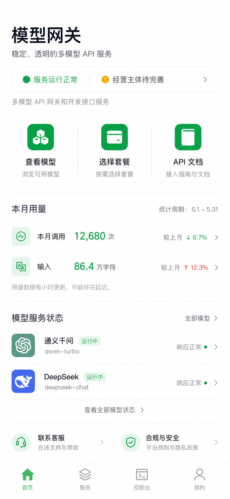

# 多模型 API 网关平台设计规格

## 1. 项目目标

建设一套真实可运行的多模型 API 服务平台，包括：

- 微信原生小程序：面向购买和使用 API 服务的用户。
- Web 运营后台：面向平台运营及管理员。
- NestJS API 服务：承载账户、网关、计费、套餐、订单和审计能力。
- 独立服务器部署：通过备案域名和 HTTPS 对外提供小程序 API 与模型网关。

首版成功标准是完整跑通：

`用户登录 -> 获取套餐 -> 创建 API Key -> 调用兼容模型 -> 扣减用量 -> 查看日志和订单`

微信支付资质未就绪时，订单和支付模块使用明确的测试驱动，不伪造真实付款结果。

## 2. 已确认约束

- 小程序使用微信原生技术。
- 后端采用 Node.js、NestJS、PostgreSQL 和 Redis。
- 系统采用模块化单体架构，保留未来拆分服务的边界。
- 模型上游使用可配置的 OpenAI 兼容接口。
- 上游地址、模型供应商密钥和其他凭据只通过服务器环境变量配置。
- Web 运营后台与普通用户入口分离。
- 经营主体、客服、服务器地区、保存期限等资料由后台配置。
- 生产模式启用前必须通过运营资料完整性校验。
- 不在代码、文档、日志或小程序包中保存 API Key、密码、Cookie、银行卡或个人证件资料。

## 3. 分阶段交付

### 阶段一：核心后端与运营后台

- 用户及管理员认证。
- 模型、供应商、套餐和运营资料维护。
- API Key 生命周期管理。
- OpenAI 兼容网关。
- 字符计量、套餐扣减和调用日志。
- 订单、退款、发票申请的状态流转。
- 审计日志、限流和风险控制。

### 阶段二：微信小程序

- 微信登录和账户初始化。
- 首页、模型列表、服务套餐和 API 文档。
- API Key 创建与停用。
- 用量、日志、订单、退款和发票记录。
- 隐私与数据说明、内容安全规则。
- 客服与投诉入口。

### 阶段三：上线能力

- 微信支付下单、回调验签和退款接口。
- 备案域名、HTTPS、服务器和数据库部署。
- 监控、备份、告警和安全加固。
- 真实经营主体、客服电话、供应商和数据保存政策配置。
- 小程序审核及发布前检查。

## 4. 产品信息架构

### 4.1 微信小程序

底部设置四个主导航：

1. **首页**
   - “多模型 API 网关和开发接口服务”介绍。
   - 经营主体和服务运行状态。
   - 模型、套餐、API 文档快捷入口。
   - 当前套餐和本月用量摘要。
   - 客服、隐私与合规入口。

2. **服务**
   - 模型列表：能力、计费单位、上下文限制和服务状态。
   - 服务套餐：价格、额度、生效方式、有效期和退款条件。
   - API 文档：地址、鉴权、参数、错误码和示例。
   - 隐私与数据说明。
   - 内容安全规则。

3. **控制台**
   - API Key 创建、命名和停用。
   - 调用次数、输入量、输出量和套餐消耗。
   - 脱敏调用日志。
   - 订单、付款、发票和退款记录。

4. **我的**
   - 账户资料和协议确认记录。
   - 发票抬头。
   - 客服和投诉。
   - 隐私政策、用户协议和账户注销。

### 4.2 Web 运营后台

- 仪表盘：用户、调用、消耗、收入、错误和风险摘要。
- 用户管理：状态、套餐、Key 数量、调用和封禁。
- 供应商与模型管理：模型映射、能力、计价、状态和路由优先级。
- 套餐管理：额度、有效期、适用模型、退款规则和上下架。
- 订单管理：创建、支付、取消、退款和异常订单。
- 发票管理：申请、审核、开具和驳回。
- 合规配置：经营主体、客服、服务器地区、供应商、保存期限和删除方式。
- 风控管理：违规记录、限流、封禁和人工复核。
- 审计日志：管理员敏感操作留痕。

管理员账户不得通过小程序普通登录入口获得后台权限。

## 5. 视觉与交互

已选择“微信服务台”方向作为视觉基准：

设计原则：

- 微信原生、简洁、可信，白色为基础页面色。
- 微信绿色用于主要操作、正常状态和重点数字。
- 通过留白、分组和分隔线建立层级，减少卡片和阴影。
- 正文按移动端 14 至 16 像素可读字号设计。
- 首页信息均衡；控制台允许更高的数据密度。
- 不使用促销倒计时、虚假稀缺、默认勾选或诱导购买。
- 真实经营资料未配置时显示“待完善”，不得使用虚构主体和电话。

## 6. 系统架构

### 6.1 应用组成

- `apps/miniapp`：微信原生小程序。
- `apps/admin-web`：React 管理后台。
- `apps/api-server`：NestJS 模块化单体。
- `packages/contracts`：跨端共享 API 类型、错误码和数据契约。
- `packages/config`：非敏感的共享配置约定。

### 6.2 后端模块

- `auth`：微信登录、管理员登录、会话和权限。
- `users`：用户状态、协议确认和注销。
- `providers`：上游供应商配置引用和健康状态。
- `models`：公开模型、能力、路由和计价。
- `plans`：套餐模板、用户套餐和消耗规则。
- `api-keys`：平台 API Key 创建、哈希、校验和停用。
- `gateway`：OpenAI 兼容请求解析、转发和响应适配。
- `metering`：字符计量、调用记录和扣减。
- `orders`：订单状态机和套餐发放。
- `payments`：微信支付适配、回调验签和测试驱动。
- `refunds`：退款申请、审核和支付退款适配。
- `invoices`：发票申请及状态。
- `compliance`：隐私、内容安全和运营资料完整性。
- `risk`：限流、异常用量和封禁。
- `audit`：管理员敏感操作留痕。

### 6.3 基础设施

- PostgreSQL 保存业务数据和审计记录。
- Redis 保存限流计数、短期缓存和异步任务。
- Nginx 提供 HTTPS、域名路由、请求体限制和基础防护。
- 后台任务处理计费补偿、健康检查、通知和数据清理。
- 日志和监控不得记录明文平台 Key、上游 Key、完整请求正文或完整模型响应。

## 7. API Key 安全

- 平台 Key 使用高熵随机值生成，并包含可识别前缀。
- 数据库仅保存 Key 哈希、末尾四位、名称、状态和创建时间。
- 明文 Key 只在创建成功页面完整返回一次。
- 页面离开后不能再次查询完整 Key，只允许创建新 Key。
- Key 停用立即生效。
- 日志只允许显示掩码形式，例如 `sk-gw-****9A2F`。
- 上游供应商 Key 只存在服务器环境变量或部署平台密钥管理系统。

## 8. 模型调用与计费

### 8.1 调用流程

1. 读取并验证平台 API Key。
2. 检查用户、Key、模型和服务状态。
3. 执行 IP、Key 和用户维度的限流。
4. 检查可用套餐和剩余额度。
5. 执行内容安全与滥用规则检查。
6. 将请求转换为上游 OpenAI 兼容格式。
7. 调用上游模型并返回普通或流式响应。
8. 计算输入和输出字符量。
9. 在数据库事务中记录调用并扣减套餐。
10. 更新用量汇总和异常告警。

### 8.2 计量规则

- 输入量和输出量分开记录。
- 字符数采用 Unicode 码点数量，换行和空格计入字符数。
- 后台为每个公开模型配置输入与输出扣减倍率。
- 用户有多个适用套餐时，优先消耗最早到期的套餐。
- 同一到期时间下，优先消耗最早生效的套餐。
- 套餐扣减必须使用数据库事务和行锁，避免并发超扣。
- 上游明确失败且没有有效输出时不扣减套餐。
- 流式响应已输出内容后中断时，按实际输出量计费，并记录中断原因。
- 上游未返回可核验用量时，由平台按请求和响应文本计算字符量。

### 8.3 日志

默认保存：

- 请求 ID、用户、Key 标识和模型。
- 输入字符、输出字符、扣减额度和套餐。
- HTTP 状态码、平台错误码、耗时和上游请求 ID。
- 创建时间、IP 哈希及脱敏错误摘要。

默认不保存：

- 完整提示词。
- 完整模型响应。
- 明文 API Key。
- 上游鉴权头。

运营后台可配置日志保存期限；到期清理任务必须可审计。

## 9. 套餐、订单、支付、退款与发票

### 9.1 套餐

每个套餐必须配置：

- 名称、售价和币种。
- 输入额度、输出额度或统一额度。
- 适用模型。
- 生效方式和有效期。
- 退款条件。
- 上下架状态和用户购买前确认文案。

示例套餐名称可使用“开发测试套餐”和“100 万输入字符调用包”，但价格和具体退款政策必须由经营者在上线前确认。

### 9.2 订单状态

订单状态为：

`PENDING_PAYMENT -> PAID -> FULFILLED`

还允许：

- `PENDING_PAYMENT -> CANCELLED`
- `PAID -> REFUND_PENDING -> REFUNDED`
- `REFUND_PENDING -> REFUND_REJECTED`

支付成功后发放套餐必须幂等，同一支付单不得重复发放。

### 9.3 微信支付

- 真实支付启用前必须配置小程序 AppID、商户号、证书和回调地址。
- 支付回调必须验签、校验金额和商户订单号。
- 未获得资质时只能使用本地测试驱动或沙箱式状态模拟。
- 测试驱动必须显示“测试支付”，不能产生或宣称真实扣款。

### 9.4 退款和发票

- 首版提供退款申请、审核结果和记录查询。
- 自动原路退款在微信支付资质和接口可用后启用。
- 发票模块首版提供抬头、申请、审核和状态记录。
- 未接入真实电子发票服务时，不得显示“已开具”。

## 10. 隐私、数据与内容安全

隐私页面必须从后台读取并公开：

- 输入数据会发送到哪些模型供应商。
- 各供应商用途。
- 平台服务器地区。
- 日志和业务数据保存期限。
- 用户申请导出、删除和注销的方式。
- 客服和投诉渠道。

内容安全规则至少禁止：

- 违法违规内容。
- 诈骗、钓鱼和冒充。
- 未授权攻击、恶意代码和凭据窃取。
- 侵犯知识产权或隐私。
- 绕过限流、批量注册、转售 Key 和其他批量滥用。

风控措施包括规则拦截、频率限制、异常用量告警、人工封禁和申诉记录。禁止只依赖前端提示实现安全控制。

## 11. 异常与一致性

- 上游超时、限流和故障映射为平台统一错误码。
- 余额不足、Key 停用、模型停用、请求超限和内容违规使用不同错误码。
- 错误响应包含请求 ID，不泄露内部堆栈和上游密钥。
- 订单支付回调、套餐发放和退款回调必须幂等。
- 计费写入失败时进入补偿队列，不静默丢失。
- 后台退款、封禁、改价和生产模式切换必须二次确认并写审计日志。
- 运营资料不完整时，系统拒绝切换生产模式。

## 12. 测试策略

### 单元测试

- Key 生成、哈希和校验。
- 套餐选择优先级。
- 字符计量和倍率计算。
- 订单、支付和退款状态机。
- 错误码映射和日志脱敏。

### 集成测试

- PostgreSQL 事务及并发扣减。
- Redis 限流和任务队列。
- OpenAI 兼容供应商普通响应与流式响应。
- 支付回调验签、金额校验和幂等处理。

### 端到端测试

- 微信测试身份登录。
- 获取测试套餐。
- 创建且只查看一次完整 Key。
- 调用模型并扣减额度。
- 查看用量、日志和订单。
- 管理员维护模型、套餐与合规资料。

### 安全测试

- 普通用户访问管理接口。
- 用户读取其他用户的 Key、订单和日志。
- 暴力请求、重复回调和并发超扣。
- 明文 Key、提示词和响应是否进入日志。

## 13. 部署与上线门槛

生产发布前必须全部满足：

- 经营主体和客服电话为真实有效信息。
- 隐私政策列出真实供应商、服务器地区、保存期限和删除方式。
- 小程序合法域名、备案和 HTTPS 已配置。
- 微信支付资质、商户配置和回调验签通过真实环境验证。
- 数据库自动备份和恢复演练完成。
- 监控覆盖 API 可用率、上游错误率、计费失败和支付异常。
- 环境变量、证书和密钥不进入 Git 仓库。
- 管理员启用强密码策略和多因素认证。
- 安全测试和核心端到端测试通过。

## 14. 非目标

首版不包含：

- 多供应商自动竞价和复杂智能路由。
- 企业组织、多成员协作和子账户。
- 完整财务 ERP 或自建电子发票系统。
- 保存和搜索用户完整提示词、响应内容。
- 在支付资质未通过时进行真实扣款。
- 原生小程序之外的用户网站控制台。

